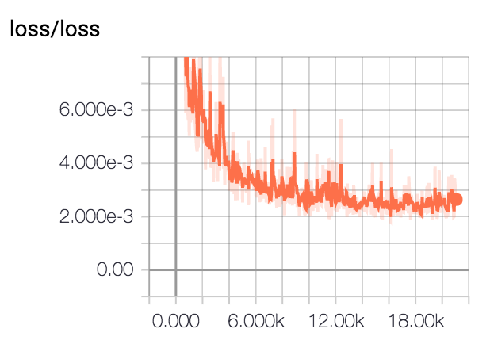
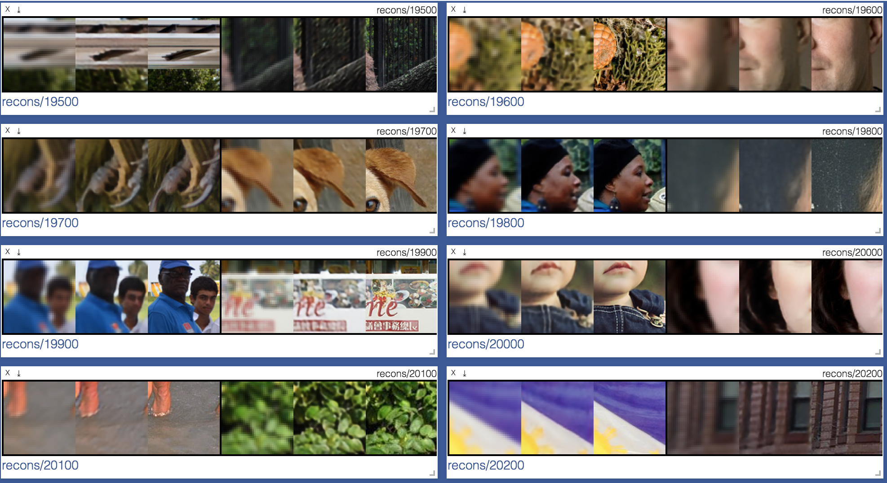

# Super-Resolution Network for Multiple Degradations (SRMD)
PyTorch/NSML Implementation of [Learning a Single Convolutional Super-Resolution Network for Multiple Degradations](http://openaccess.thecvf.com/content_cvpr_2018/papers/Zhang_Learning_a_Single_CVPR_2018_paper.pdf) (CVPR 2018)

All the files in the directories `kernels` are from [1]. 

## Requirements
- `python 3.6`
- `nsml` ([link1](https://nsml.navercorp.com/download), [link2](https://github.com/n-CLAIR/nsml-local))
- `pytorch==0.4.0`
- `visdom`
- `pillow`
- `h5py`

## Usage
First, train the network

    $ run -e main.py -d super-resolution -a "--scale_factor=2 --mode='train'"

Second, do testing (*Not implemented yet*)

    $ run -e main.py -d super-resolution -a "--scale_factor=2 --mode='test'"

## Results
### Loss (SRMDNFx2)

### Images (SRMDNFx2)
First column: LR image, Second column: SR image, Third column: HR image

## Notes
The implementation is slightly different with one in original paper.

### Original
- The last convolutional layer outputs `W x H x s^2 x C` feature maps which are reshaped with size of `sW x sH x C`.
    - Slow convergence (more investigation needed)
- At the last layer, any activation function (e.g., `sigmoid`, `tanh`) is not used.
    - Not stable results (bouncing pixels even after large iterations)

## Ours
- We upsample the feature map and then use convolutional layer with channel size of `3`.
- We put a sigmoid function right after the last convolutional layer.

## To-Do
* [ ] To upload test data to NSML server
* [ ] To implement `test()` method of `class Solver` considering users' favor (specific blur kernel as input)
* [ ] To train on the other scale factors (SRMDNFx3, SRMDNFx4)
* [ ] To considering additive noise after downsampling (SRMDx2, SRMDx3, SRMDx4) 

## Reference
[1] [MatConvNet implementation](https://github.com/cszn/SRMD) of one author of the paper (**only test code** available, as of June 27, 2018)

## Contact
Dongkyu Kim (d.kim@navercorp.com)