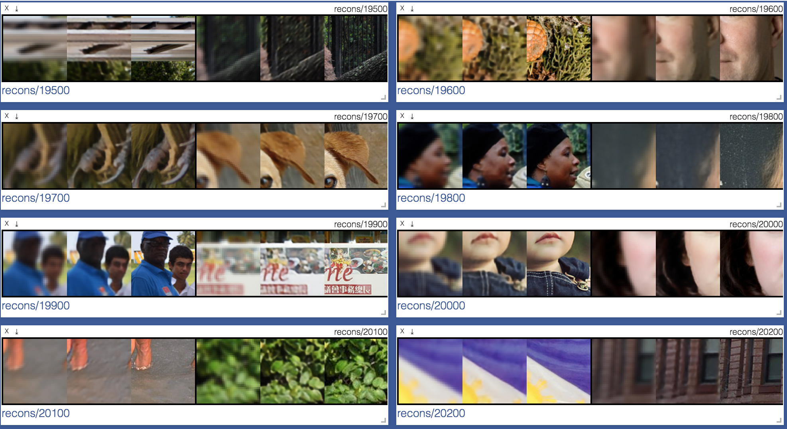
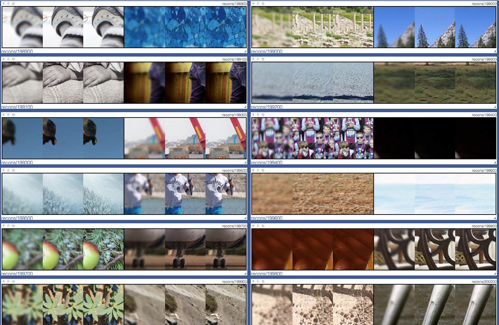
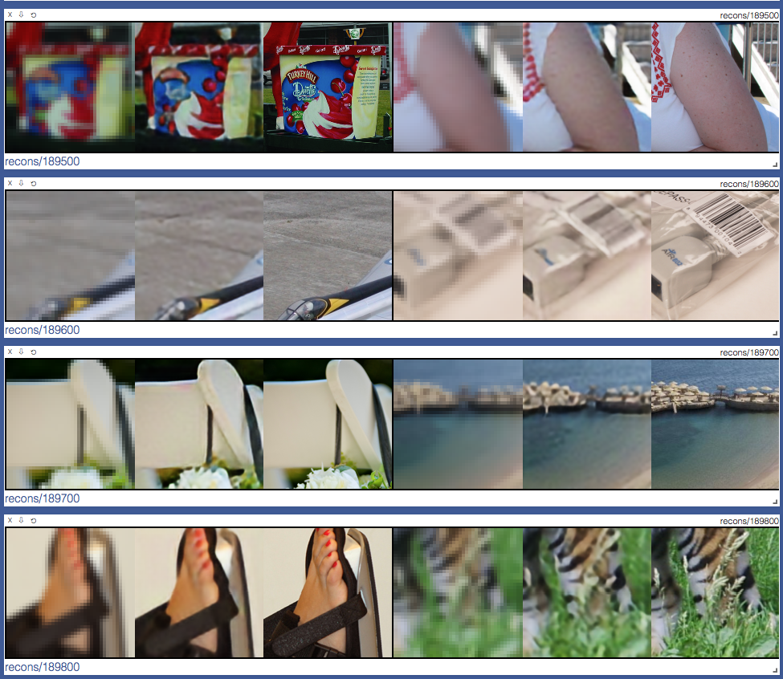

# Super-Resolution Network for Multiple Degradations (SRMD)
PyTorch Implementation of [Learning a Single Convolutional Super-Resolution Network for Multiple Degradations](http://openaccess.thecvf.com/content_cvpr_2018/papers/Zhang_Learning_a_Single_CVPR_2018_paper.pdf) (CVPR 2018)

All the files in the directory `kernels` are from [1]. 


## Requirements
- `python 3.6`
- `pytorch==0.4.0`
- `visdom`
- `pillow`
- `h5py`

## Usage
First, download images from the Internet and put them into a folder `Database` as follows:

```bash
+---SRMD-pytorch
    +---Database
        +---train                  # For training
        |       1.png
        |       10.jpg
        |        ...
        \---test                   # For testing
                5.png
                10.bmp
                 ...
```

Second, train the network

    $ python main.py --scale_factor=2 --mode='train'

Third, do testing (*Not implemented yet*)

    $ python main.py --scale_factor=2 --mode='test'

## Results
- First column: LR image, Second column: SR image, Third column: HR image
### Images (SRMDNFx2)


### Images (SRMDNFx3)


### Images (SRMDNFx4)


## Notes
- The implementation is slightly different with one in original paper.
- I put a `sigmoid` function right after the last convolutional layer.
    - No sigmoid resulted in unstable results (bouncing pixels even after large iterations)

## To-Do
* [ ] To implement method `test()` of `class Solver` considering users' favor (specific blur kernel as input)
* [x] To train on the other scale factors (SRMDNFx3, SRMDNFx4)
* [ ] To consider additive noise after downsampling (SRMDx2, SRMDx3, SRMDx4) 
* [ ] To evaluate quantitative performances of the trained networks

## Reference
[1] [MatConvNet implementation](https://github.com/cszn/SRMD) of one author of the paper (**only test code** available, as of June 27, 2018)
